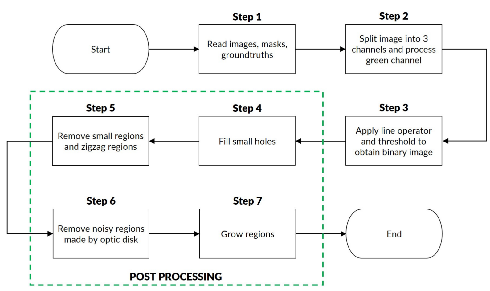
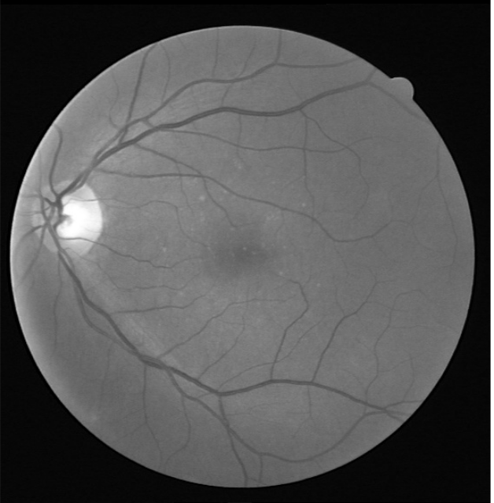
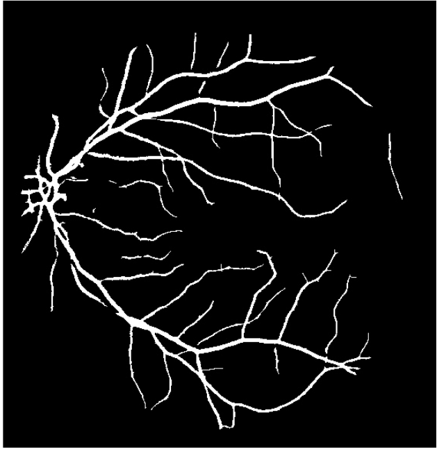
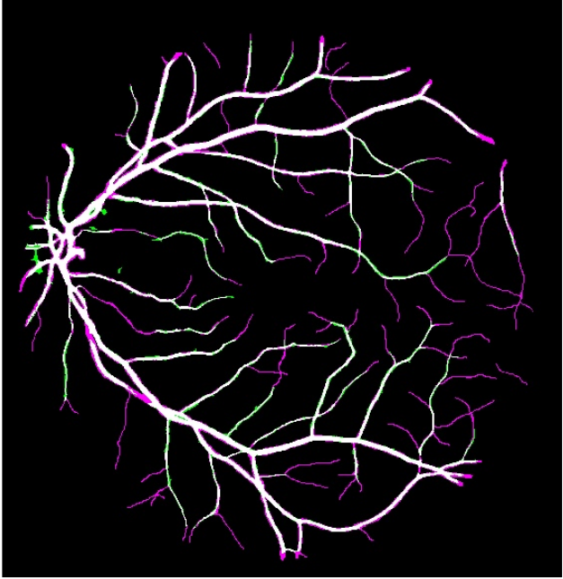

# Retinal-Vessel-Segmentation-in-Color-Fundus-Images

The goal of the project was to segment vessels of Retinal Color Fundus images. Impalementation was done in C++ using visual studio and OpenCv.

## Softwares required
- Visual Studio 2015
- OpenCv3.2

## Implemetation flow chart

## sample input and output

## sample output: True positive and False positive pixels
Red collor indicates False positive and Yellow collor is for False positive.

